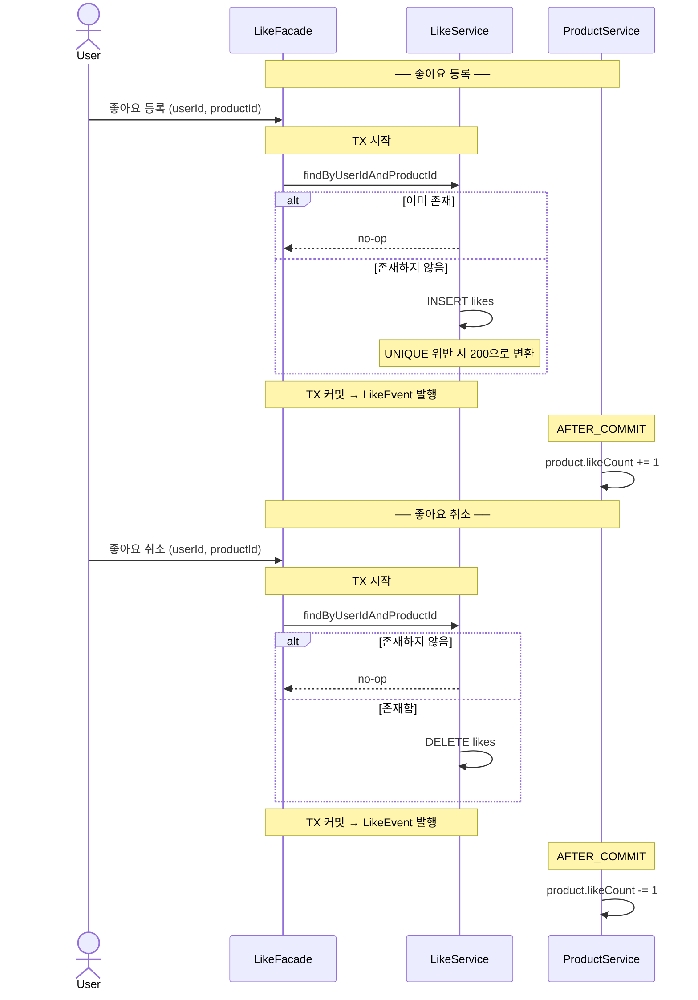
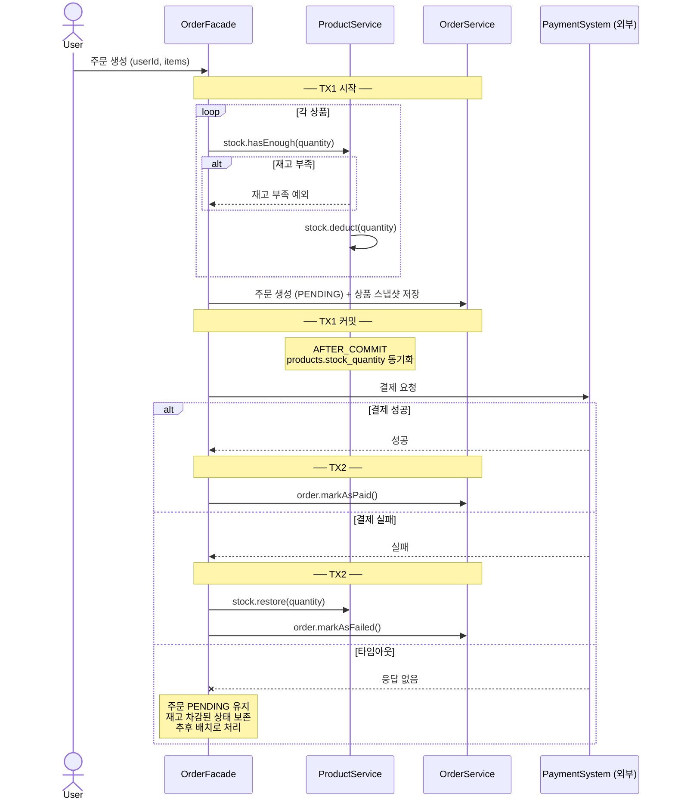

# 시퀀스 다이어그램 — 이커머스 도메인 (Week 2)

---

## 시나리오 1: 좋아요 등록/취소 (멱등 처리)

멱등성 보장 방식과 `likeCount` 갱신 흐름의 책임 경계를 확인하기 위해 작성한다.

**핵심 포인트**
- 애플리케이션 레벨에서 먼저 존재 여부를 확인해 분기한다. DB UNIQUE 제약은 동시 요청에 대한 최후 방어선이다.
- `likeCount` 갱신은 Like TX 커밋 이후 별도 TX에서 처리한다 (`@TransactionalEventListener(AFTER_COMMIT)`). Like TX가 롤백되면 이벤트 자체가 발행되지 않는다.

---

## 시나리오 2: 주문 생성

트랜잭션 경계와 결제 실패 시 보상 트랜잭션 흐름을 확인하기 위해 작성한다.

**핵심 포인트**
- TX가 두 번 열린다. 재고 차감 + 주문 생성(TX1)이 커밋된 뒤 외부 결제를 호출한다. 외부 HTTP를 TX 안에 포함하면 커넥션 점유 시간이 길어져 위험하다.
- 타임아웃 시 주문은 PENDING으로 남는다. 재고는 차감된 상태이며, 추후 배치로 처리한다.
- 재고 차감은 `product_stocks` 테이블에서 처리한다. `products.stock_quantity`는 목록 조회 캐시이므로 AFTER_COMMIT으로 별도 동기화한다.

