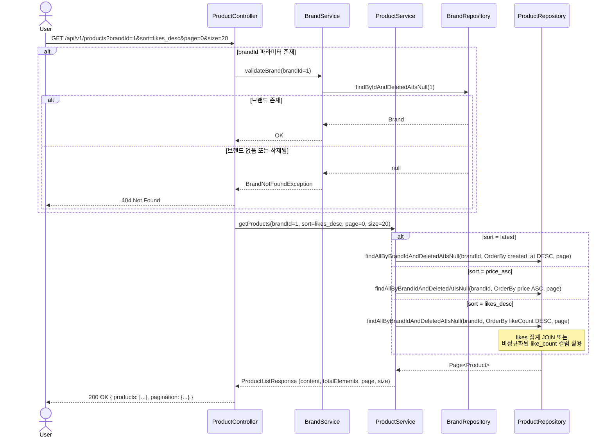
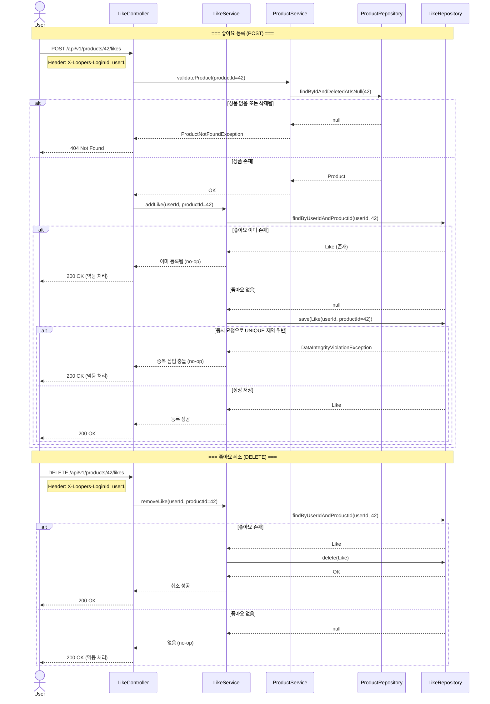
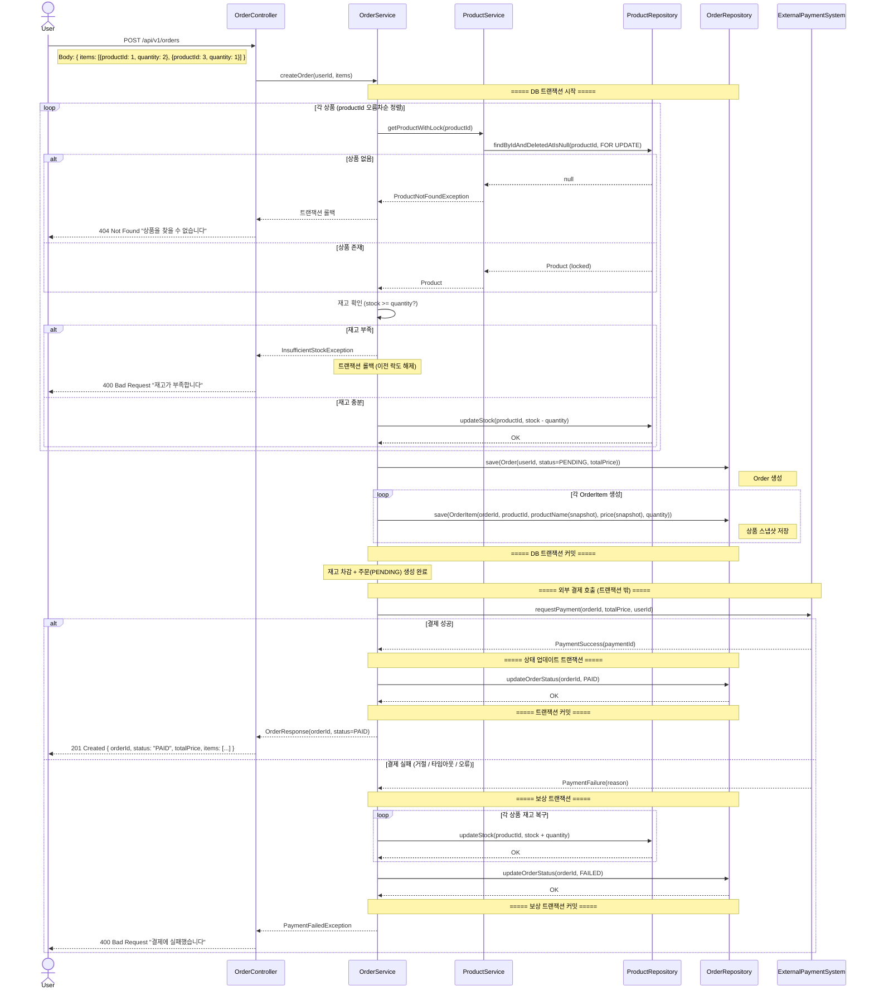

# 시퀀스 다이어그램 — 이커머스 도메인 (Week 2)

---

## 시퀀스 다이어그램 개요

시퀀스 다이어그램은 "누가 누구에게 어떤 순서로 메시지를 보내는가"를 시각화한다.
단순한 CRUD를 넘어, 조건 분기·동시성·외부 시스템 연동이 있는 흐름에서 특히 유용하다.
아래 세 시나리오는 이 시스템에서 가장 복잡한 제어 흐름을 가지므로 다이어그램으로 정리한다.

---

## 시나리오 1: 상품 목록 조회

### 왜 이 다이어그램이 필요한가

상품 목록 조회는 단순해 보이지만, 브랜드 유효성 검증 → 동적 정렬 조건 분기 → 페이지네이션의 세 단계가 연결된다.
브랜드 필터가 있을 때와 없을 때의 분기, 삭제된 브랜드로 필터 시 처리 방식을 명확히 하기 위해 작성한다.

### 봐야 할 포인트

- **브랜드 유효성 검증 위치**: brandId가 전달되면 브랜드 존재 여부를 먼저 확인한다. 삭제된 브랜드로 필터하면 404가 아니라 빈 목록을 반환할지, 400을 반환할지 결정이 필요하다. 이 설계에서는 **404 반환**으로 결정한다.
- **정렬 조건 분기**: `likes_desc` 정렬은 likes 테이블과의 JOIN 또는 집계가 필요해 다른 정렬보다 쿼리 비용이 높다. 비정규화된 `like_count` 컬럼을 두는 방식도 고려할 수 있다.
- **Soft Delete 필터**: 상품 조회 시 `deleted_at IS NULL` 조건이 항상 포함된다. 인덱스 설계 시 이 조건을 고려해야 한다.
- **페이지네이션**: 0-based 페이지 번호를 사용한다. 첫 페이지는 page=0이다.

---

## 시나리오 2: 좋아요 등록/취소 (멱등 처리)

### 왜 이 다이어그램이 필요한가

좋아요의 핵심은 **멱등성**이다. 같은 요청을 여러 번 보내도 결과가 동일해야 한다.
애플리케이션 레벨에서 SELECT → 분기 → INSERT/DELETE를 어떻게 처리하는지,
동시 요청 시 DB UNIQUE 제약이 최후 방어선 역할을 어떻게 하는지를 보여주기 위해 작성한다.

### 봐야 할 포인트

- **애플리케이션 레벨 멱등성**: DB에 중복 INSERT를 보내기 전에, 서비스 레이어에서 존재 여부를 확인하고 분기한다. 불필요한 DB 오류를 사전에 차단한다.
- **DB UNIQUE 제약의 역할**: 동시 요청으로 애플리케이션 레벨 검증을 통과한 두 요청이 동시에 INSERT를 시도할 경우, DB의 `(user_id, product_id) UNIQUE` 제약이 중복 삽입을 차단한다. 이 경우 예외를 잡아 정상 응답(200)으로 변환한다.
- **DELETE 멱등성**: 좋아요가 없을 때 DELETE 요청이 오면 오류 없이 200 OK 반환.
- **상품 존재 여부 검증**: 좋아요 등록 전 상품이 유효한지(삭제되지 않았는지) 확인한다. 삭제된 상품에 좋아요를 추가하는 것은 의미가 없으므로 404를 반환한다.
- **좋아요 취소 시 상품 검증**: 삭제된 상품의 좋아요 취소는 허용한다 (멱등성 원칙에 따라 없으면 200 반환).

---

## 시나리오 3: 주문 생성 전체 흐름

### 왜 이 다이어그램이 필요한가

주문 생성은 이 시스템에서 가장 복잡한 흐름이다.
여러 상품의 재고를 동시에 확인·차감하고, 외부 결제 시스템을 호출하며, 실패 시 보상(롤백)이 필요하다.
각 단계의 책임 경계와 트랜잭션 경계를 명확히 시각화하기 위해 작성한다.

### 봐야 할 포인트

- **트랜잭션 경계**: 재고 차감과 주문 생성은 하나의 DB 트랜잭션. 외부 결제 호출은 트랜잭션 **밖**. DB 트랜잭션 중 외부 HTTP를 호출하면 커넥션을 장시간 점유하므로 위험하다.
- **비관적 락**: 재고 차감 시 `SELECT ... FOR UPDATE`로 동시 주문에 의한 재고 초과 방지.
- **다중 상품 처리**: 여러 상품을 한 주문에 담을 때 각 상품의 재고를 순차적으로 잠근다. 락 순서가 일정하지 않으면 데드락 위험이 있으므로 productId 오름차순으로 정렬 후 처리.
- **스냅샷 저장**: OrderItem 생성 시 현재 상품의 이름과 가격을 복사해 저장. 이후 상품 정보가 바뀌어도 주문 내역은 변하지 않는다.
- **결제 실패 보상**: 결제 실패 시 DB 트랜잭션은 이미 커밋되었으므로, 별도의 보상 트랜잭션으로 재고 복구. 보상 트랜잭션도 실패할 수 있다는 점이 운영 리스크다.
- **주문 상태 PENDING**: 결제 요청 전까지 주문은 PENDING 상태로 저장된다. 결제 결과에 따라 PAID 또는 FAILED로 전이된다.

---

## 부록: 다이어그램 간 관계

| 시나리오 | 핵심 관심사 | 연관 설계 결정 |
|---|---|---|
| 상품 목록 조회 | 필터링·정렬·페이지네이션 | 인덱스 설계, likes 집계 전략 |
| 좋아요 멱등 처리 | 애플리케이션 멱등성 + DB UNIQUE 제약 | 동시성 대응, 에러 변환 전략 |
| 주문 생성 | 트랜잭션 경계, 보상 트랜잭션, 외부 연동 | 비관적 락, 스냅샷, 데드락 방지 |

세 다이어그램은 독립적이지 않다. 상품 목록 조회에서 노출된 상품을 좋아요하고, 그 상품을 주문하는 사용자 여정이 연결되어 있다.
