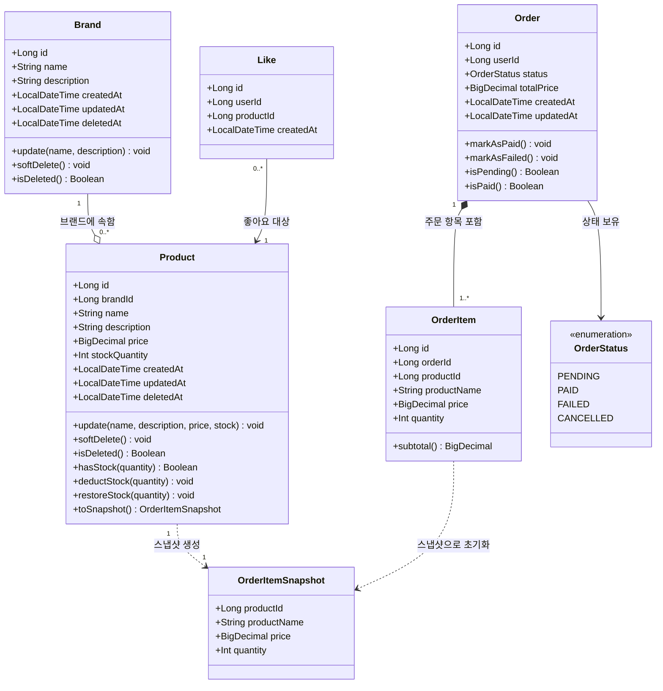

# 클래스 다이어그램 — 이커머스 도메인 (Week 2)

---

## 클래스 다이어그램 개요

클래스 다이어그램은 "어떤 도메인 개념이 있고, 그것들이 서로 어떻게 연결되는가"를 시각화한다.
단순히 테이블 구조를 나열하는 것이 아니라, 각 클래스가 어떤 비즈니스 책임을 지고,
어떤 메서드로 그 책임을 표현하는지를 보여주는 것이 목표다.

이 다이어그램에서는 도메인 레이어에 집중한다. Repository나 Controller는 포함하지 않는다.

---

## Mermaid 클래스 다이어그램



---

## 클래스별 설명

### Brand (브랜드)

브랜드는 상품의 소속을 나타내는 최상위 도메인 개념이다.

| 필드/메서드 | 설명 |
|---|---|
| `id` | 자동 증가 PK |
| `name` | 브랜드명 (유일해야 함) |
| `description` | 브랜드 설명 |
| `createdAt / updatedAt` | 생성·수정 일시 (자동 관리) |
| `deletedAt` | Soft Delete 처리 시 기록되는 삭제 일시. null이면 활성 상태 |
| `update(name, description)` | 브랜드 정보 수정. 브랜드 내부에서 필드를 직접 변경하는 책임을 가짐 |
| `softDelete()` | deletedAt에 현재 시각 기록. 이후 CASCADE Soft Delete 트리거 |
| `isDeleted()` | deletedAt != null 여부 반환 |

**설계 의도**: 브랜드 삭제는 `softDelete()` 메서드를 통해서만 이루어지도록 캡슐화한다. 서비스 레이어가 직접 `deletedAt`을 조작하지 않고 도메인 메서드를 호출하게 함으로써, 도메인 규칙이 도메인 객체 내부에 위치하도록 한다.

---

### Product (상품)

상품은 재고를 관리하는 핵심 도메인이다. 재고 차감과 복구는 반드시 상품 도메인 객체를 통해 이루어진다.

| 필드/메서드 | 설명 |
|---|---|
| `id` | 자동 증가 PK |
| `brandId` | 소속 브랜드 ID (FK). 생성 후 변경 불가 |
| `name` | 상품명 |
| `description` | 상품 설명 |
| `price` | 상품 가격 (BigDecimal: 부동소수점 오류 방지) |
| `stockQuantity` | 현재 재고 수량 (0 이상) |
| `deletedAt` | Soft Delete 기록 |
| `update(...)` | 이름, 설명, 가격, 재고 수정. brandId 수정은 제공하지 않음 |
| `hasStock(quantity)` | 요청 수량만큼 재고가 있는지 확인 |
| `deductStock(quantity)` | 재고 차감. 재고 부족 시 예외 발생 |
| `restoreStock(quantity)` | 결제 실패 보상 시 재고 복구 |
| `toSnapshot()` | 현재 시점의 name, price를 OrderItemSnapshot으로 변환 |

**설계 의도**: `deductStock()`과 `restoreStock()`을 도메인 메서드로 두면, 재고 연산의 유효성 검증(0 이하 불가 등)이 한 곳에 모인다. 서비스 레이어에서 직접 `stockQuantity--`를 하지 않는다.

**`brandId`를 객체 참조가 아닌 ID로 두는 이유**: JPA `@ManyToOne`으로 Brand를 직접 참조할 수도 있지만, 집계 루트(Aggregate Root) 개념에 따라 Brand와 Product를 별도 집계로 보고 ID 참조만 유지한다. Brand 전체를 Product 조회 시마다 JOIN하는 비용을 줄이는 효과도 있다.

---

### Like (좋아요)

좋아요는 유저와 상품 간의 관계를 나타내는 단순한 연결 엔티티다.

| 필드/메서드 | 설명 |
|---|---|
| `id` | 자동 증가 PK |
| `userId` | 좋아요를 누른 유저 ID |
| `productId` | 좋아요 대상 상품 ID |
| `createdAt` | 좋아요 등록 일시 |

**설계 의도**: Like는 비즈니스 로직이 거의 없는 단순 레코드다. 핵심은 `(userId, productId)`의 UNIQUE 제약으로 중복을 방지하는 것이다. 별도의 도메인 메서드 없이 값 보유 역할만 수행한다.

**updatedAt이 없는 이유**: 좋아요는 생성/삭제만 있고 수정 개념이 없다. 수정 일시를 관리할 필요가 없다.

---

### Order (주문)

주문은 결제 상태를 추적하고 OrderItem의 집합을 포함하는 집계 루트다.

| 필드/메서드 | 설명 |
|---|---|
| `id` | 자동 증가 PK |
| `userId` | 주문한 유저 ID |
| `status` | 주문 상태 (OrderStatus Enum) |
| `totalPrice` | 전체 주문 금액 (주문 시점 계산, 이후 변경 없음) |
| `createdAt / updatedAt` | 생성·수정 일시 |
| `markAsPaid()` | 결제 성공 시 status를 PAID로 변경 |
| `markAsFailed()` | 결제 실패 시 status를 FAILED로 변경 |
| `isPending() / isPaid()` | 상태 확인 메서드 |

**설계 의도**: 상태 전이는 `markAsPaid()`, `markAsFailed()` 등 의미 있는 메서드를 통해서만 이루어진다. `setStatus(OrderStatus.PAID)` 형태를 직접 호출하지 않게 하여, 잘못된 상태 전이(예: FAILED → PAID)를 도메인 객체가 방어할 수 있다.

---

### OrderItem (주문 항목)

OrderItem은 Order에 포함된 개별 상품 항목이다. 상품의 스냅샷 정보를 저장한다.

| 필드/메서드 | 설명 |
|---|---|
| `id` | 자동 증가 PK |
| `orderId` | 소속 주문 ID |
| `productId` | 원본 상품 ID (참조 목적, 없어져도 OrderItem은 독립적) |
| `productName` | 주문 시점의 상품명 (스냅샷) |
| `price` | 주문 시점의 상품 단가 (스냅샷) |
| `quantity` | 주문 수량 |
| `subtotal()` | price * quantity 계산 |

**설계 의도**: `productName`과 `price`는 Product 테이블이 아닌 OrderItem 자체에 저장된다. 이후 상품명이나 가격이 변경되어도 주문 내역은 주문 당시의 값을 보존한다. `productId`는 참조용으로 남기되, 상품이 삭제되어도 OrderItem이 영향받지 않도록 설계한다.

---

### OrderItemSnapshot (주문 항목 스냅샷 VO)

Product가 OrderItem으로 변환되는 과정에서 중간 값 객체(Value Object) 역할을 한다.

| 필드 | 설명 |
|---|---|
| `productId` | 상품 ID |
| `productName` | 스냅샷 시점의 상품명 |
| `price` | 스냅샷 시점의 단가 |
| `quantity` | 요청 수량 |

**설계 의도**: Product → OrderItem 변환 로직을 Product 도메인 내부(`toSnapshot()`)에 캡슐화하고, OrderItem의 생성자가 Snapshot을 받아 초기화하도록 한다. 서비스 레이어가 개별 필드를 일일이 꺼내 OrderItem에 넣는 코드를 작성하지 않아도 된다.

---

### OrderStatus (주문 상태 Enum)

| 값 | 설명 |
|---|---|
| `PENDING` | 주문이 생성되었으나 결제 미완료 |
| `PAID` | 결제 완료 |
| `FAILED` | 결제 실패 |
| `CANCELLED` | 주문 취소 (현재 범위 외, 확장 예정) |

---

## 클래스 간 관계 해석

### Brand - Product (집합 관계, Aggregation)

```
Brand "1" --o "0..*" Product
```

- 하나의 Brand는 여러 Product를 가질 수 있다.
- Brand가 삭제되면 Product도 Soft Delete된다 (CASCADE).
- 단, Product가 Brand 없이 독립적으로 존재할 수 없는 것은 아니다 (스냅샷에 product_name이 저장되므로 참조 자체가 끊어지지는 않음).
- **집합(Aggregation)** 으로 표현한 이유: Brand와 Product는 생명주기가 완전히 동일하지는 않다. Brand가 삭제되어도 Product의 데이터는 유지된다 (Soft Delete).

### Order - OrderItem (합성 관계, Composition)

```
Order "1" *-- "1..*" OrderItem
```

- 하나의 Order는 반드시 하나 이상의 OrderItem을 가진다.
- OrderItem은 Order 없이 존재할 수 없다. Order가 삭제되면 OrderItem도 함께 삭제되어야 한다.
- **합성(Composition)** 으로 표현한 이유: OrderItem은 Order의 일부이며, 독립적인 생명주기를 가지지 않는다.

### Product - OrderItemSnapshot (의존 관계)

```
Product "1" ..> "1" OrderItemSnapshot
```

- Product의 `toSnapshot()` 메서드가 OrderItemSnapshot을 생성한다.
- 단방향 의존이며, Snapshot은 Product와 별도로 저장된다.

---

## 봐야 할 포인트 (설계 의도 요약)

1. **도메인 메서드를 통한 캡슐화**: `deductStock()`, `markAsPaid()`, `softDelete()` 등 비즈니스 로직을 도메인 객체 메서드로 표현한다. 서비스가 필드를 직접 조작하지 않는다.
2. **스냅샷 패턴**: 주문 시점의 상품 정보를 OrderItem에 복사 저장하여, 상품 변경이 주문 내역에 영향을 주지 않도록 격리한다.
3. **ID 참조 방식**: Brand-Product, Product-Like, Order-OrderItem 간 객체 참조 대신 ID 참조를 사용한다. JPA 연관 관계 매핑의 복잡성을 줄이고, 도메인 간 결합도를 낮춘다.
4. **Soft Delete 일관성**: Brand와 Product 모두 `deletedAt`으로 Soft Delete를 관리한다. 쿼리 시 `deleted_at IS NULL` 조건을 일관되게 적용해야 한다.

---

## 잠재 리스크

### 1. 도메인 간 결합도 (Brand ↔ Product)

Brand 삭제 시 Product의 Soft Delete를 서비스 레이어에서 처리할 경우, 서비스 코드가 두 도메인에 걸쳐 있다. Brand 삭제 로직이 변경되면 Product 처리 로직도 함께 수정해야 하는 위험이 있다.

**대응 방안**: 도메인 이벤트(Domain Event) 패턴 적용. `BrandDeletedEvent`를 발행하면 `ProductEventHandler`가 받아 처리하는 방식으로 결합도를 낮출 수 있다.

### 2. 트랜잭션 비대화 (Order 생성)

주문 생성 시 여러 상품의 재고 조회(FOR UPDATE), 재고 차감, 주문 생성, OrderItem 생성이 하나의 트랜잭션에 포함된다. 상품 수가 많을수록 트랜잭션이 커지고, 락 보유 시간이 길어져 성능 저하가 발생할 수 있다.

**대응 방안**: 단일 주문에 담을 수 있는 상품 수 제한 (예: 최대 10개). 또는 배치 처리를 통한 재고 차감 최적화.

### 3. 보상 트랜잭션의 신뢰성

결제 실패 후 보상 트랜잭션(재고 복구)도 실패할 수 있다. 이 경우 재고는 감소했으나 주문은 FAILED 상태인 불일치가 발생한다.

**대응 방안**: Outbox 패턴 또는 이벤트 소싱으로 보상 작업의 신뢰성 보장. 최소한 실패 알림을 운영팀에 전달하는 체계 마련.

### 4. `likes_desc` 정렬 성능

상품 목록을 좋아요 수 기준으로 정렬하려면 좋아요 수를 실시간으로 집계해야 한다. 데이터가 많아질수록 쿼리 비용이 증가한다.

**대응 방안**: Product 테이블에 `like_count` 컬럼을 비정규화하여 좋아요 등록/취소 시 업데이트. 집계 쿼리 없이 정렬 가능. 단, 이중 업데이트에 의한 불일치 리스크 존재.

### 5. 헤더 기반 인증의 보안 취약성

`X-Loopers-LoginId`/`LoginPw` 헤더와 `X-Loopers-Ldap` 헤더는 인터셉터에서 검증하는 구조다. 프로덕션 환경에서는 JWT 또는 OAuth 기반 인증으로 전환이 필요하다.
