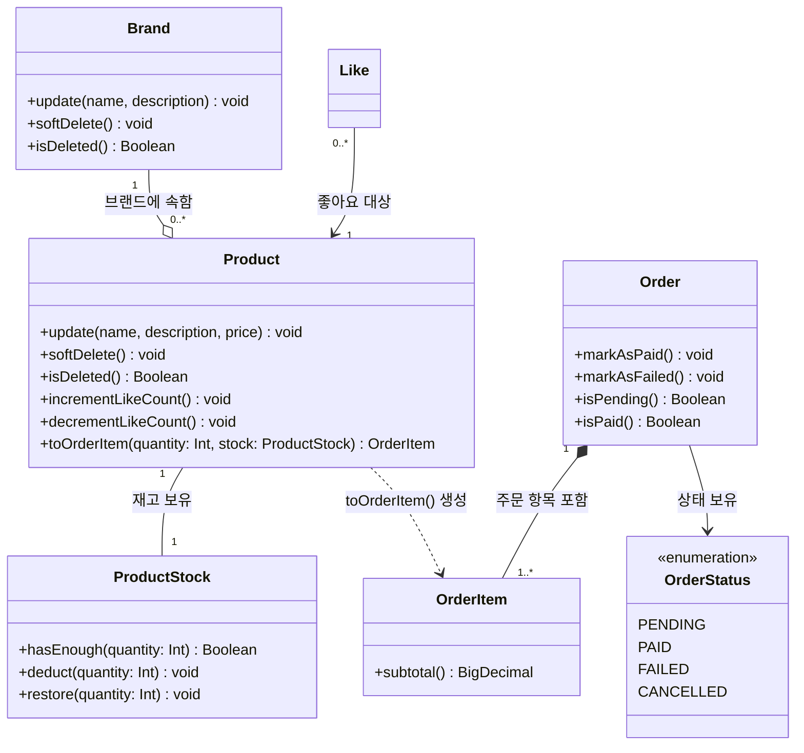

# 클래스 다이어그램 — 이커머스 도메인 (Week 2)

---

## 목적

도메인 레이어의 책임 분리와 의존 방향을 확인한다. Repository·Controller는 포함하지 않는다.

---

## Mermaid 클래스 다이어그램

---

## 설계 포인트

### 재고 책임 분리 (Product vs ProductStock)

`Product.stockQuantity`는 목록 조회용 캐시다. 실제 재고 유효성 검증(`hasEnough`)과 차감/복구(`deduct/restore`)는 `ProductStock`이 담당한다. 주문 시 `ProductStock`을 직접 조작하고, 변경 후 AFTER_COMMIT으로 `Product.stockQuantity`를 동기화한다.

`toOrderItem(quantity, stock)`이 `stock`을 인자로 받는 이유도 여기서 비롯된다. Product 혼자 재고를 검증하지 않는다.

### 스냅샷 패턴 (OrderItem)

`OrderItem`은 `productName`, `price`를 직접 저장한다. 상품명·가격이 나중에 바뀌어도 주문 당시 값이 보존된다. `Product.toOrderItem()`이 스냅샷 생성 책임을 가지며, 중간 VO는 두지 않는다.

### 상태 전이 캡슐화 (Order)

`markAsPaid()`, `markAsFailed()` 메서드를 통해서만 상태가 바뀐다. 서비스가 `setStatus(PAID)`를 직접 호출하지 못하도록 막아, 잘못된 상태 전이를 도메인 객체가 방어한다.

### ID 참조

Brand-Product, Like-Product 등 도메인 간 경계는 객체 참조 대신 ID 참조로 유지한다. 집계 루트(Aggregate Root)를 명확히 하고, 불필요한 JOIN 연쇄를 막는다.

---

## 잠재 리스크

### 1. Brand 삭제 시 Product Soft Delete 처리

Brand는 Product를 알지 못한다. 브랜드 삭제 시 Product Soft Delete는 `BrandService`가 직접 처리한다. Brand 삭제 로직이 바뀌면 Product 처리도 함께 수정해야 하는 결합이 존재한다.

**현재 선택**: Service 레이어 직접 처리 (단순성 우선).
**대안**: `BrandDeletedEvent` 발행 → `ProductEventHandler` 처리 — 결합도는 낮아지지만 이벤트 추적 복잡도가 올라감.

### 2. 보상 트랜잭션의 신뢰성

결제 실패 후 재고 복구(보상 TX)도 실패할 수 있다. 재고는 감소했지만 주문은 FAILED인 불일치가 발생할 수 있다.

**대응 방안**: 최소한 실패 알림을 운영팀에 전달하는 체계 마련. 이후 Outbox 패턴으로 보완.

### 3. `likeCount` 갱신 지연

`likeCount`는 AFTER_COMMIT 이벤트로 갱신되므로, Like 저장 직후 잠깐 미반영 상태가 존재한다.

**허용 근거**: `likes` 테이블이 원본. `likeCount`는 정렬 성능을 위한 파생값이므로 약간의 지연은 감수한다. 주기적 재집계 배치로 보완 가능.
