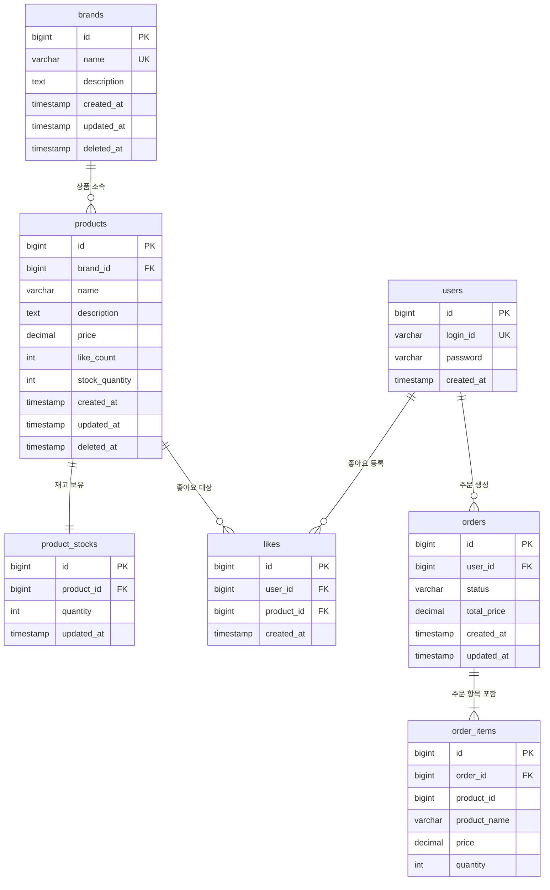

# ERD (Entity-Relationship Diagram) — 이커머스 도메인 (Week 2)

---

## ERD 개요

ERD는 "어떤 데이터를 어떻게 저장하는가"를 표현한다.
클래스 다이어그램이 도메인 객체의 행위(메서드)를 포함한다면, ERD는 실제 데이터베이스 테이블 구조와 관계에 집중한다.
이 ERD는 Mermaid `erDiagram` 문법으로 작성되었으며, 각 테이블의 설계 의도와 제약 조건을 함께 기술한다.

---

## Mermaid ERD



> **주의**: `order_items.product_id`는 FK 제약을 의도적으로 설정하지 않는다. 상품이 Soft Delete되거나 이름/가격이 변경되어도 order_items는 주문 당시의 스냅샷 데이터를 독립적으로 보유해야 하기 때문이다. product_id는 참조 목적(CS 추적)으로만 남긴다.

---

## 테이블별 상세 설명

### users (유저)

유저는 이 서비스의 핵심 액터다. 현재 요구사항에서 회원가입/내 정보 조회는 범위 외이나, 좋아요·주문의 소유자 식별을 위해 테이블을 정의한다.

| 컬럼 | 타입 | 제약 | 설명 |
|---|---|---|---|
| `id` | BIGINT | PK, AUTO_INCREMENT | 유저 식별자 |
| `login_id` | VARCHAR(50) | UNIQUE, NOT NULL | 로그인 아이디. 헤더 `X-Loopers-LoginId`와 매핑 |
| `password` | VARCHAR(255) | NOT NULL | 비밀번호 (해시 저장 권장) |
| `created_at` | TIMESTAMP | NOT NULL | 가입 일시 |

**설계 의도**: 헤더 `X-Loopers-LoginId`로 전달된 로그인 ID를 DB에서 조회하여 `user.id`를 얻는다. 모든 좋아요와 주문은 이 `user.id`를 FK로 참조한다. `deleted_at`을 두지 않은 것은 현재 범위(회원 탈퇴 미구현)를 반영한 것이다.

---

### brands (브랜드)

상품의 소속 브랜드를 나타낸다.

| 컬럼 | 타입 | 제약 | 설명 |
|---|---|---|---|
| `id` | BIGINT | PK, AUTO_INCREMENT | 브랜드 식별자 |
| `name` | VARCHAR(100) | UNIQUE, NOT NULL | 브랜드명. 중복 불가 |
| `description` | TEXT | NULLABLE | 브랜드 설명 |
| `created_at` | TIMESTAMP | NOT NULL | 생성 일시 |
| `updated_at` | TIMESTAMP | NOT NULL | 수정 일시 |
| `deleted_at` | TIMESTAMP | NULLABLE | Soft Delete 처리 일시. null이면 활성 상태 |

**설계 의도**: `name` 컬럼에 UNIQUE 제약을 걸어 브랜드명 중복을 DB 레벨에서도 방지한다. `deleted_at`이 null인 레코드만 활성 브랜드로 취급한다.

**주의**: `name`의 UNIQUE 제약은 Soft Delete된 브랜드와 충돌할 수 있다. 삭제된 브랜드와 동일한 이름으로 새 브랜드를 만들 수 없다. 이 경우 UNIQUE 제약을 `(name, deleted_at)` 복합 조건으로 변경하거나, 애플리케이션 레벨에서 활성 브랜드만 중복 검증하는 방식을 선택해야 한다.

---

### products (상품)

브랜드에 속하는 개별 상품 정보를 관리한다. 재고는 `product_stocks` 테이블로 분리한다.

| 컬럼 | 타입 | 제약 | 설명 |
|---|---|---|---|
| `id` | BIGINT | PK, AUTO_INCREMENT | 상품 식별자 |
| `brand_id` | BIGINT | FK → brands.id, NOT NULL | 소속 브랜드 |
| `name` | VARCHAR(200) | NOT NULL | 상품명 |
| `description` | TEXT | NULLABLE | 상품 설명 |
| `price` | DECIMAL(10, 2) | NOT NULL, CHECK (price > 0) | 상품 가격 |
| `like_count` | INT | NOT NULL, DEFAULT 0 | 좋아요 수 (비정규화 집계값) |
| `created_at` | TIMESTAMP | NOT NULL | 생성 일시 |
| `updated_at` | TIMESTAMP | NOT NULL | 수정 일시 |
| `deleted_at` | TIMESTAMP | NULLABLE | Soft Delete 처리 일시 |

**설계 의도**:
- `price`는 DECIMAL을 사용한다. FLOAT/DOUBLE은 부동소수점 오차로 금액 계산 시 문제가 생길 수 있다.
- `stock_quantity`는 목록 조회 전용 캐시값이다. `product_stocks.quantity`가 원본이며, 상세 조회·주문 검증은 반드시 `product_stocks`를 사용한다. 목록에서 JOIN 없이 재고 여부를 빠르게 표시하기 위한 비정규화다.
- `like_count`와 동일하게 `AFTER_COMMIT` 이벤트로 `product_stocks` 변경 후 동기화한다.
- `brand_id`는 brands.id를 참조하는 FK다. ON DELETE CASCADE를 사용하지 않고 애플리케이션에서 CASCADE Soft Delete를 처리한다.

---

### product_stocks (상품 재고)

상품의 재고 수량을 별도로 관리한다. Product와 1:1 관계다.

| 컬럼 | 타입 | 제약 | 설명 |
|---|---|---|---|
| `id` | BIGINT | PK, AUTO_INCREMENT | 재고 식별자 |
| `product_id` | BIGINT | FK → products.id, UNIQUE | 대상 상품 (1:1) |
| `quantity` | INT | NOT NULL, CHECK (quantity >= 0) | 현재 재고 수량 |
| `updated_at` | TIMESTAMP | NOT NULL | 재고 변경 일시 |

**설계 의도**:
- 재고 차감/복원이 products 행을 건드리지 않아 상품 조회와 재고 변경이 분리된다.
- `quantity >= 0` CHECK 제약으로 DB 레벨에서도 음수 재고를 방지한다.
- `product_id`에 UNIQUE 제약으로 1:1 관계를 강제한다.
- 추후 `stock_histories` 테이블을 추가하거나, 창고별 재고(`warehouse_id`)를 확장하기 용이한 구조다.

---

### likes (좋아요)

유저와 상품 간의 좋아요 관계를 기록한다.

| 컬럼 | 타입 | 제약 | 설명 |
|---|---|---|---|
| `id` | BIGINT | PK, AUTO_INCREMENT | 좋아요 식별자 |
| `user_id` | BIGINT | FK → users.id, NOT NULL | 좋아요를 누른 유저 |
| `product_id` | BIGINT | FK → products.id, NOT NULL | 좋아요 대상 상품 |
| `created_at` | TIMESTAMP | NOT NULL | 좋아요 등록 일시 |

**제약 조건**: `UNIQUE (user_id, product_id)` — 동일 유저가 동일 상품에 좋아요를 중복 등록하는 것을 DB 레벨에서 방지한다.

**설계 의도**: `updated_at`이 없다. 좋아요는 생성과 삭제만 있고 수정 개념이 없다. `id` 대신 `(user_id, product_id)` 복합 PK를 사용하는 방법도 있으나, 범용 PK 패턴(auto increment id + unique 제약)을 유지한다.

---

### orders (주문)

유저의 주문 헤더 정보를 저장한다. 개별 상품 정보는 order_items에 분리된다.

| 컬럼 | 타입 | 제약 | 설명 |
|---|---|---|---|
| `id` | BIGINT | PK, AUTO_INCREMENT | 주문 식별자 |
| `user_id` | BIGINT | FK → users.id, NOT NULL | 주문한 유저 |
| `status` | VARCHAR(20) | NOT NULL | 주문 상태 (PENDING / PAID / FAILED / CANCELLED) |
| `total_price` | DECIMAL(12, 2) | NOT NULL | 전체 주문 금액 |
| `created_at` | TIMESTAMP | NOT NULL | 주문 생성 일시 |
| `updated_at` | TIMESTAMP | NOT NULL | 주문 상태 변경 일시 |

**설계 의도**:
- `status`는 ENUM 타입 또는 VARCHAR로 저장한다. VARCHAR를 사용하면 신규 상태 추가 시 DB 스키마 변경 없이 확장 가능하다.
- `total_price`는 주문 시점에 계산된 값을 저장한다. 이후 상품 가격이 변경되어도 이 값은 변하지 않는다.
- `deleted_at`을 두지 않는다. 주문은 삭제 개념이 없고 상태 전이로만 관리된다.

---

### order_items (주문 항목)

주문에 포함된 개별 상품 정보를 스냅샷으로 저장한다.

| 컬럼 | 타입 | 제약 | 설명 |
|---|---|---|---|
| `id` | BIGINT | PK, AUTO_INCREMENT | 주문 항목 식별자 |
| `order_id` | BIGINT | FK → orders.id, NOT NULL | 소속 주문 |
| `product_id` | BIGINT | NOT NULL (FK 없음) | 원본 상품 ID (참조용) |
| `product_name` | VARCHAR(200) | NOT NULL | 주문 시점 상품명 (스냅샷) |
| `price` | DECIMAL(10, 2) | NOT NULL | 주문 시점 상품 단가 (스냅샷) |
| `quantity` | INT | NOT NULL, CHECK (quantity > 0) | 주문 수량 |

**설계 의도**:
- `product_name`과 `price`는 products 테이블에서 복사한 스냅샷이다. products의 name/price가 변경되어도 order_items는 영향받지 않는다.
- `product_id`는 FK 제약 없이 저장한다. products가 Soft Delete되어도 order_items는 독립적으로 조회 가능해야 한다.
- `quantity`에 `CHECK (quantity > 0)` 제약을 두어 0 이하 수량 주문을 방지한다.

---

## 주요 인덱스 및 제약 조건 요약

### 인덱스

| 테이블 | 인덱스 | 목적 |
|---|---|---|
| `products` | `idx_products_brand_id` (brand_id) | 브랜드별 상품 목록 조회 |
| `products` | `idx_products_brand_id_deleted_at` (brand_id, deleted_at) | 활성 상품 브랜드 필터 조회 |
| `products` | `idx_products_price` (price) | 가격 오름차순 정렬 |
| `products` | `idx_products_created_at` (created_at DESC) | 최신순 정렬 |
| `products` | `idx_products_deleted_at` (deleted_at) | Soft Delete 필터 |
| `likes` | `uk_likes_user_product` (user_id, product_id) UNIQUE | 중복 좋아요 방지, 조회 성능 |
| `likes` | `idx_likes_product_id` (product_id) | 상품별 좋아요 수 집계 |
| `likes` | `idx_likes_user_id` (user_id) | 유저 좋아요 목록 조회 |
| `orders` | `idx_orders_user_id` (user_id) | 유저별 주문 목록 조회 |
| `orders` | `idx_orders_created_at` (created_at) | 기간 필터 조회 |
| `orders` | `idx_orders_user_id_created_at` (user_id, created_at) | 유저별 기간 조회 복합 인덱스 |
| `order_items` | `idx_order_items_order_id` (order_id) | 주문 상세 조회 |

### 제약 조건 요약

| 테이블 | 제약 | 내용 |
|---|---|---|
| `brands` | UNIQUE | name |
| `products` | FK | brand_id → brands.id |
| `products` | CHECK | price > 0 |
| `product_stocks` | UNIQUE | product_id |
| `product_stocks` | CHECK | quantity >= 0 |
| `likes` | UNIQUE | (user_id, product_id) |
| `likes` | FK | user_id → users.id |
| `likes` | FK | product_id → products.id |
| `orders` | FK | user_id → users.id |
| `order_items` | FK | order_id → orders.id |
| `order_items` | CHECK | quantity > 0 |

---

## 정합성 고려사항

### Soft Delete 처리 방식

**왜 Soft Delete를 사용하는가?**

물리 삭제(DELETE)를 사용하면 다음 문제가 발생한다.

1. `order_items.product_id`가 가리키는 products 레코드가 사라진다 → FK 참조 무결성 위반 또는 orphan 발생.
2. 브랜드 삭제 후 해당 브랜드의 상품에 연결된 이전 주문 내역을 추적할 수 없다.
3. 실수로 삭제했을 때 복구가 불가능하다.

**Soft Delete 구현 원칙**:

- `deleted_at IS NULL` 조건을 모든 유저 조회 쿼리에 적용한다.
- JPA에서는 `@Where(clause = "deleted_at IS NULL")` 또는 JPA 필터로 자동 적용을 고려한다.
- 어드민 API는 `deleted_at IS NOT NULL`인 데이터도 조회할 수 있어야 한다.

**CASCADE Soft Delete (brands → products)**:

브랜드를 Soft Delete할 때 해당 브랜드의 모든 products에도 `deleted_at`을 설정한다.
이는 DB ON DELETE CASCADE가 아닌 애플리케이션 레벨에서 처리한다. 이유는 다음과 같다.

- DB CASCADE는 물리 삭제에만 동작하며 Soft Delete를 지원하지 않는다.
- 애플리케이션에서 처리하면 부분 실패 시 트랜잭션 롤백으로 원자성을 보장할 수 있다.

---

### 스냅샷 저장 이유

`order_items`에 `product_name`과 `price`를 별도로 저장하는 이유는 다음과 같다.

| 상황 | 스냅샷 없을 때 문제 | 스냅샷 있을 때 |
|---|---|---|
| 상품 가격 변경 | 이전 주문의 가격이 현재 가격으로 보임 | 주문 당시 가격 보존 |
| 상품명 변경 | 이전 주문에서 새 상품명이 표시됨 | 주문 당시 상품명 보존 |
| 상품 Soft Delete | products JOIN 시 null 반환 가능 | 독립적으로 조회 가능 |
| CS 분쟁 | "내가 주문한 가격이 다르다"는 분쟁 발생 | 스냅샷으로 근거 제시 |

---

### 재고 동시성 처리

`product_stocks.quantity` 컬럼은 동시 주문 시 경쟁 조건(Race Condition)이 발생할 수 있다. 현재 범위에서는 미고려이며, 추후 아래 방법으로 대응한다.

```sql
-- 비관적 락 방식
SELECT * FROM product_stocks WHERE product_id = ? FOR UPDATE;

-- 또는 조건부 UPDATE 방식
UPDATE product_stocks
SET quantity = quantity - ?
WHERE product_id = ? AND quantity >= ?;
-- 영향받은 행 수가 0이면 재고 부족으로 처리
```

`product_stocks`를 별도 테이블로 분리함으로써, 락 범위가 products 전체 행이 아닌 재고 행만으로 좁아지는 이점이 있다.

---

## 잠재 리스크 및 개선 여지

### 1. brands.name UNIQUE와 Soft Delete 충돌

삭제된 브랜드와 동일한 이름으로 새 브랜드를 만들 수 없다.

**개선 방안**:
- `UNIQUE (name)` 대신 애플리케이션에서 `WHERE deleted_at IS NULL`로 중복 검증.
- 또는 DB에 Partial Unique Index 사용: `CREATE UNIQUE INDEX uk_brands_name ON brands (name) WHERE deleted_at IS NULL;` (PostgreSQL 지원)

### 2. likes 집계 성능

`likes_desc` 정렬을 위해 상품별 좋아요 수를 실시간 집계하면, 데이터가 많아질수록 `COUNT` 쿼리가 느려진다.

**개선 방안**:
- `products` 테이블에 `like_count INT DEFAULT 0` 컬럼을 추가하여 비정규화.
- 좋아요 등록/취소 시 `like_count`를 `UPDATE products SET like_count = like_count + 1 WHERE id = ?`로 갱신.
- 단, 비정규화 데이터는 배치 검증으로 주기적으로 보정해야 한다.

### 3. 주문 상태 이력 부재

현재 `orders.status` 컬럼은 최신 상태만 저장한다. 상태가 어떻게 변했는지 이력이 없다.

**개선 방안**: `order_status_history` 테이블 추가.

```
order_status_history: id, order_id, status, created_at, reason
```

장애 발생 시 디버깅과 CS 처리에 유용하다.

### 4. order_items.product_id FK 부재로 인한 데이터 추적 어려움

`product_id`에 FK가 없으므로 products 테이블과 JOIN하면 Soft Delete된 상품은 조회되지 않을 수 있다.

**개선 방안**: products를 Soft Delete할 때 `deleted_at`을 설정하지만 레코드는 남기므로, LEFT JOIN을 사용하거나 `WHERE deleted_at IS NULL` 조건을 제거하고 조회하면 된다.

### 5. 쿠폰 및 할인 미설계

현재 `orders.total_price`는 상품 가격의 합계만 저장한다. 쿠폰이나 할인 적용 시 구조 변경이 필요하다.

**개선 방안**:
```
orders 테이블에 discount_price, coupon_id 컬럼 추가
order_coupons 테이블 별도 생성
```

### 6. 대용량 주문 목록 페이지네이션

`GET /api/v1/orders?startAt=&endAt=`는 기간 필터를 사용하지만, 페이지네이션 없이 전체 조회하면 데이터가 많을 때 문제가 된다.

**개선 방안**: 주문 목록 API에도 `page` / `size` 파라미터 추가. `(user_id, created_at)` 복합 인덱스로 기간 조회 성능 확보.
