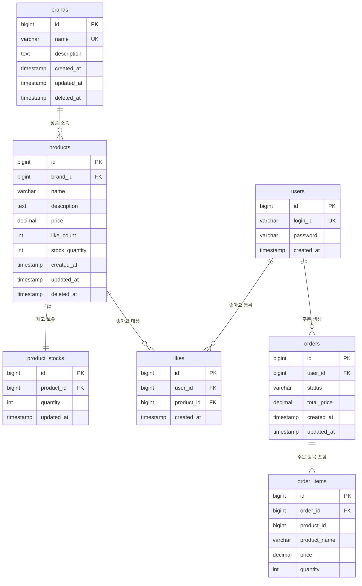

# ERD (Entity-Relationship Diagram) — 이커머스 도메인 (Week 2)

---

## 목적

클래스 다이어그램이 도메인 객체의 행위(메서드)를 다룬다면, ERD는 실제 테이블 구조, 관계, 제약 조건에 집중한다.

---

## Mermaid ERD

> **주의**: `order_items.product_id`는 FK 제약을 의도적으로 설정하지 않는다. 상품이 삭제되거나 정보가 변경되어도 주문 시점의 스냅샷 데이터를 독립적으로 보유해야 하기 때문이다.

---

## 테이블별 상세 설명

### users (유저)

| 컬럼 | 타입 | 제약 | 설명 |
|---|---|---|---|
| `id` | BIGINT | PK, AUTO_INCREMENT | 유저 식별자 |
| `login_id` | VARCHAR(50) | UNIQUE, NOT NULL | 로그인 아이디 |
| `password` | VARCHAR(255) | NOT NULL | 비밀번호 |
| `created_at` | TIMESTAMP | NOT NULL | 가입 일시 |

`X-Loopers-LoginId` 헤더로 전달된 로그인 ID를 DB에서 조회하여 `user.id`를 얻는다. 모든 좋아요와 주문은 이 `user.id`를 참조한다. 회원 탈퇴가 현재 범위 외이므로 `deleted_at`은 두지 않는다.

---

### brands (브랜드)

| 컬럼 | 타입 | 제약 | 설명 |
|---|---|---|---|
| `id` | BIGINT | PK, AUTO_INCREMENT | 브랜드 식별자 |
| `name` | VARCHAR(100) | UNIQUE, NOT NULL | 브랜드명 |
| `description` | TEXT | NULLABLE | 브랜드 설명 |
| `created_at` | TIMESTAMP | NOT NULL | 생성 일시 |
| `updated_at` | TIMESTAMP | NOT NULL | 수정 일시 |
| `deleted_at` | TIMESTAMP | NULLABLE | Soft Delete 처리 일시 |

`name`에 UNIQUE 제약을 걸어 브랜드명 중복을 DB 레벨에서도 방지한다. `deleted_at IS NULL`인 레코드만 활성 브랜드로 취급한다.

Soft Delete 시 `name`을 `{name}_deleted_{id}` 형태로 변경한다. UNIQUE 제약을 유지하면서도 동일한 이름으로 새 브랜드를 생성할 수 있게 된다.

---

### products (상품)

| 컬럼 | 타입 | 제약 | 설명 |
|---|---|---|---|
| `id` | BIGINT | PK, AUTO_INCREMENT | 상품 식별자 |
| `brand_id` | BIGINT | FK → brands.id, NOT NULL | 소속 브랜드 |
| `name` | VARCHAR(200) | NOT NULL | 상품명 |
| `description` | TEXT | NULLABLE | 상품 설명 |
| `price` | DECIMAL(10, 2) | NOT NULL, CHECK (price > 0) | 상품 가격 |
| `like_count` | INT | NOT NULL, DEFAULT 0 | 좋아요 수 (비정규화 집계값) |
| `stock_quantity` | INT | NOT NULL, DEFAULT 0 | 목록 조회용 재고 캐시 |
| `created_at` | TIMESTAMP | NOT NULL | 생성 일시 |
| `updated_at` | TIMESTAMP | NOT NULL | 수정 일시 |
| `deleted_at` | TIMESTAMP | NULLABLE | Soft Delete 처리 일시 |

- `price`는 DECIMAL을 사용한다. FLOAT/DOUBLE은 부동소수점 오차로 금액 계산에 문제가 생길 수 있다.
- `stock_quantity`는 목록 조회 전용 캐시값이다. 원본은 `product_stocks.quantity`이며, 재고 검증과 차감은 반드시 `product_stocks`를 사용한다. 주문 처리 후 AFTER_COMMIT 이벤트로 동기화된다.
- `like_count`도 동일하게 비정규화 집계값이다. Like 등록/취소 후 AFTER_COMMIT 이벤트로 갱신된다.

---

### product_stocks (상품 재고)

| 컬럼 | 타입 | 제약 | 설명 |
|---|---|---|---|
| `id` | BIGINT | PK, AUTO_INCREMENT | 재고 식별자 |
| `product_id` | BIGINT | FK → products.id, UNIQUE | 대상 상품 (1:1) |
| `quantity` | INT | NOT NULL, CHECK (quantity >= 0) | 현재 재고 수량 (원본) |
| `updated_at` | TIMESTAMP | NOT NULL | 재고 변경 일시 |

재고 차감/복구가 `products` 행을 건드리지 않아 상품 조회와 재고 변경이 분리된다. `quantity >= 0` CHECK 제약으로 DB 레벨에서도 음수 재고를 방지한다. `product_id`에 UNIQUE 제약으로 1:1 관계를 강제한다.

---

### likes (좋아요)

| 컬럼 | 타입 | 제약 | 설명 |
|---|---|---|---|
| `id` | BIGINT | PK, AUTO_INCREMENT | 좋아요 식별자 |
| `user_id` | BIGINT | FK → users.id, NOT NULL | 좋아요를 누른 유저 |
| `product_id` | BIGINT | FK → products.id, NOT NULL | 좋아요 대상 상품 |
| `created_at` | TIMESTAMP | NOT NULL | 좋아요 등록 일시 |

`UNIQUE (user_id, product_id)` 제약으로 동일 유저의 중복 좋아요를 DB 레벨에서 방지한다. 좋아요는 생성/삭제만 있으므로 `updated_at`은 두지 않는다.

---

### orders (주문)

| 컬럼 | 타입 | 제약 | 설명 |
|---|---|---|---|
| `id` | BIGINT | PK, AUTO_INCREMENT | 주문 식별자 |
| `user_id` | BIGINT | FK → users.id, NOT NULL | 주문한 유저 |
| `status` | VARCHAR(20) | NOT NULL | PENDING / PAID / FAILED / CANCELLED |
| `total_price` | DECIMAL(12, 2) | NOT NULL | 전체 주문 금액 (주문 시점 계산값) |
| `created_at` | TIMESTAMP | NOT NULL | 주문 생성 일시 |
| `updated_at` | TIMESTAMP | NOT NULL | 주문 상태 변경 일시 |

`status`는 VARCHAR로 저장하여 신규 상태 추가 시 스키마 변경 없이 확장 가능하다. `total_price`는 주문 시점에 고정되며 이후 상품 가격 변경에 영향받지 않는다. 주문은 삭제 개념 없이 상태 전이로만 관리하므로 `deleted_at`은 두지 않는다.

---

### order_items (주문 항목)

| 컬럼 | 타입 | 제약 | 설명 |
|---|---|---|---|
| `id` | BIGINT | PK, AUTO_INCREMENT | 주문 항목 식별자 |
| `order_id` | BIGINT | FK → orders.id, NOT NULL | 소속 주문 |
| `product_id` | BIGINT | NOT NULL (FK 없음) | 원본 상품 ID (참조용) |
| `product_name` | VARCHAR(200) | NOT NULL | 주문 시점 상품명 (스냅샷) |
| `price` | DECIMAL(10, 2) | NOT NULL | 주문 시점 상품 단가 (스냅샷) |
| `quantity` | INT | NOT NULL, CHECK (quantity > 0) | 주문 수량 |

`product_name`과 `price`는 주문 시점의 스냅샷이다. 상품명/가격이 변경되거나 상품이 삭제되어도 주문 내역은 영향받지 않는다. `product_id`는 CS 추적 목적의 참조용이며 FK 제약을 두지 않는다.

---

## 주요 제약 조건 요약

| 테이블 | 제약 | 내용 |
|---|---|---|
| `brands` | UNIQUE | name |
| `products` | FK | brand_id → brands.id |
| `products` | CHECK | price > 0 |
| `product_stocks` | UNIQUE | product_id |
| `product_stocks` | CHECK | quantity >= 0 |
| `likes` | UNIQUE | (user_id, product_id) |
| `likes` | FK | user_id → users.id, product_id → products.id |
| `orders` | FK | user_id → users.id |
| `order_items` | FK | order_id → orders.id |
| `order_items` | CHECK | quantity > 0 |

---

## 잠재 리스크

### 1. 보상 트랜잭션 실패 시 재고 불일치

결제 실패 후 재고 복구(보상 TX)도 실패하면, 재고는 차감됐으나 주문은 FAILED인 상태가 된다.

**대응 방안**: 운영팀 알림 체계 마련. 이후 Outbox 패턴으로 보완.

### 2. 주문 상태 이력 부재

`orders.status`는 현재 상태만 저장한다. 상태 변경 이력이 없어 장애 디버깅과 CS 처리가 어렵다.

**대응 방안**: `order_status_history (id, order_id, status, created_at)` 테이블 추가.
